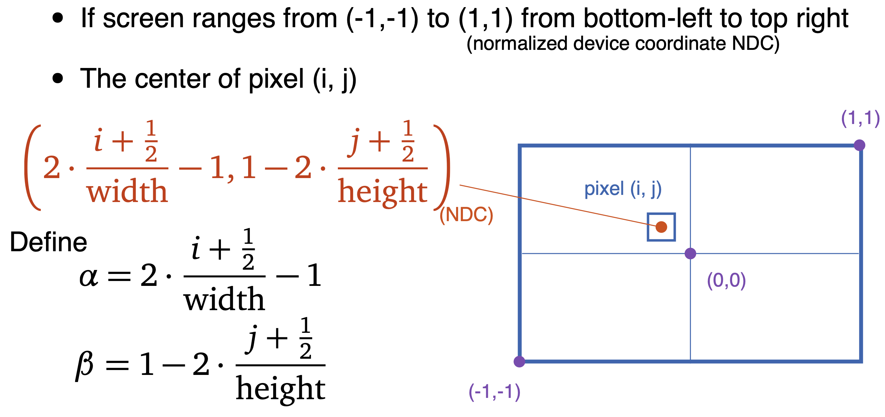

<h1>Ray Tracing (Casting)</h1>

    Instead of using rasterization, here I'm using Ray Casting to iterate every pixels, shoot a ray through each pixel, and find the closest intersect triangle in every geometry in the scene. Then for each intersected triangle, we need to create a second ray shoot from the hit point to light sources to check for visibility, this will find the shadow if it's not visible by the light. A problem for find shadow is to avoid self-shadow, which will give a bunch of black dots in the scene. To avoid self-shadow, we simply move the hit point a little, in my case, I multiplied hit position by 1.03 and it worked just find. Next is reflection, reflection will need another ray shoots out from the hit point, based on the material normal, it will have different reflected direction. For the reflection, I did recursively with recursion depth 5. Since reflection may never stop, so we need to force it to stop with maximum recursion depth.

In order to accomplish the functionality of ray tracing, here I created 5 core functions: 
    

<h3 style="color:skyblue">void Raytrace(Camera* cam, RTScene &RTscene, Image& image)</h3> 
<h4 style="color:lightgreen">
The parameters passed into this function are Camera pointer, Scene, and Image. Camera pointer is a pointer to Scene camera, Scene is the scene we created for this ray tracing project, Image is the class used to store colors into pixels, and will call Image.draw() in main for display final scene.
</h4>

Raytrace function is the main function that iterates through all pixels in a width x height screen. For each pixel, it will call RayThruPixel first that shoots a Ray from Camera through the current pixel. Then it call Intersect_Scene function, that returns the closest hit point of the ray and all triangles in the scene. Last it call FindColor function that return a color and assign to current pixel.

<h3 style="color:skyblue">Ray RayThruPixel(Camera* cam, int i, int j, int width, int height)</h3> 
<h4 style="color:lightgreen">
The parameters passed into this function are Camera pointer that points to Scene camera, and i, j are the index of current pixel, width and height is screen width and height.
</h4>

In RayThruPixel function, we basically return a Ray from Camera through current pixel, In order to do so, we have to first calculate the Camera vectors, 
    
w is eye to target vector, u is the up vector and v is the right vector, all 3 vectors need to be normalized. 
    
Then we can have the aspect ratio, field of view information from Camera. Since we want the ray to shoot through the center of the pixel, here is what we need to do. 
    
Once we have all the values ready, we need to decide whether to do this in world space or camera space. World space is easier and is what I did. So I set the ray position to eye position, and direction is calculated by this formula .
     
    Once we calculated the ray, we can return it and pass it into the next function Intersection Intersect_Triangle. 

<h3 style="color:skyblue">Intersection Intersect_Scene(Ray ray, RTScene &RTscene)</h3> 
<h4 style="color:lightgreen">
The parameters passed into this function are the Ray that generated from RayThruPixel function, and the Scene.
</h4>

In Intersect_Scene function, we need to find the closest hit of the Ray, here what I did is a very slow approach that we need to iterate all trangles of the scene in order to find the closest hit. once we find the closest hit, we can return the Intersection and pass it to the Next function FindColor.

<h3 style="color:skyblue">Intersection Intersect_Triangle(Ray ray, Triangle& triangle)</h3> 
<h4 style="color:lightgreen">
The parameters passed into this function are the Ray that generated from Intersect_Scene function, intersection triangle.
</h4>

In Intersect_Triangle function, we need to check whether the ray is intersect with the triangle, I used the following equations, 
    
The Mat4 is created with triangle parameter positions, and the last column is negative ray direction. the vec4 at the right hand side is ray position pad with 1. Then use the inverse of the Mat4 times the ray position vec4, we will get the vec4 with all the coefficients and t, here t is the distance of the hit. If all the coefficient are greater equal to 0, it means a hit, and we need to update the intersection information. Here is the equation for Intersect position and normal,

Intersection distance is t, Incoming ray direction is negative of ray direction. Last reference the intersectin triangle to the current triangle. Return this Intersection. if there is no hit, then it will return the Intersection with default initialize value distance to INFINITY.

<h3 style="color:skyblue">glm::vec3 FindColor(RTScene &RTscene, Intersection hit, int recursion_depth)</h3> 
<h4 style="color:lightgreen">
The parameters passed into this function are the Scene, Intersectin returned from Intersect_Scene, and the maximum recursion depth.
</h4>

In FindColor function, it need to return a color for each pixel based on the passed in parameters. First create color with background color value, then check if the hit are actually intersect with any triangles, if no just return background color for this pixel. If there is a hit, then we need to give it ambient color fist, then generate another Ray that shoot directly to all the light sources by Calling the function Intersection Intersect_Scene(Ray ray, RTScene &RTscene). To avoid self-shadow, I times the Ray position by 1.03 to move it a little bit. If there is a hit, which means that something is blocking the triangle to reach the light sources, then it should be shadow, so give it black color vec3(0.f).

Once done with checking shadows, next is generate a new Ray for mirror reflection. start at the same position, the direction of reflection are calculated as following,

After create the reflection Ray, we will check for hit by calling function Intersection Intersect_Scene(Ray ray, RTScene &RTscene) again. Then call Find color recursively with the reflection hit information. the recursion will stop if there is no hit or reach the maximum recursive depth.

